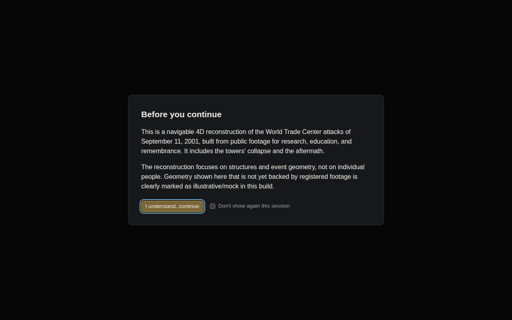
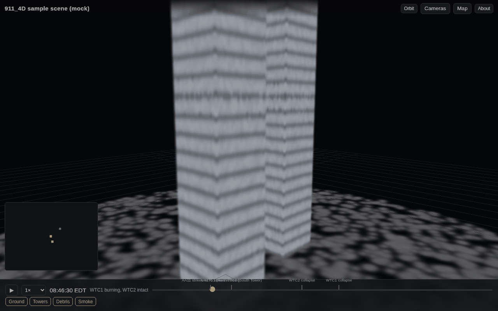
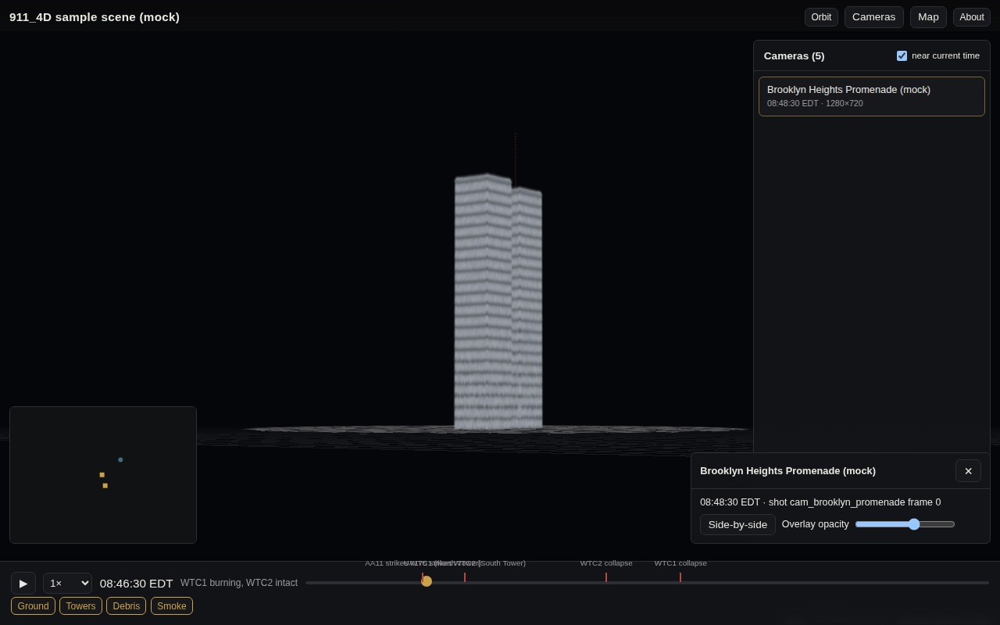

# 911_4D web viewer

A Three.js viewer for the project's `SceneManifest`: scrub time across the
morning of 2001-09-11, fly the 3D scene of Gaussian splats, toggle layers,
and step into any registered footage camera to compare it against the
reconstruction ("evidence view"). Dark, museum-like, works on phones.

This package owns `web/` and `.github/workflows/web.yml`/`pages.yml` — see
the repo root `CONTRIBUTING.md` for cross-workstream conventions.

|                                        |                                        |
| -------------------------------------- | -------------------------------------- |
|  |  |



(Screenshots are of the bundled synthetic sample scene — see
[Mock scene generator](#mock-scene-generator).)

## Quick start

```bash
cd web
npm install
npm run dev   # http://localhost:5173
```

`npm run dev`/`build` automatically (re)generate the bundled sample scene
first (`public/sample/*.ply` + `manifest.json`, via `npm run make-mock-scene`)
— those `.ply` files are build artifacts, not committed (the repo's root
`.gitignore` blocks `*.ply` everywhere to keep real reconstruction data out
of git; `manifest.json` itself *is* committed since it's small and worth
diffing).

By default the viewer loads `public/sample/manifest.json`. Point it at any
other manifest with a query param:

```
http://localhost:5173/?manifest=https://example.org/scenes/e2/manifest.json
```

Other scripts:

```bash
npm run typecheck   # tsc --noEmit
npm test            # vitest (pose conversion, ENU maths, manifest validation, timeline logic)
npm run build        # production build to dist/
npm run preview      # serve dist/ locally
npm run e2e          # Playwright smoke test (loads the sample scene, screenshots it)
```

## Deploying to GitHub Pages

`.github/workflows/pages.yml` builds `web/` and deploys `web/dist` to
GitHub Pages on every push to `main` that touches `web/**`. One-time setup:
in the repo's **Settings → Pages**, set **Source** to "GitHub Actions". The
build sets `VITE_BASE=/911_4D/` so asset URLs resolve correctly under
`https://<org>.github.io/911_4D/`; update that env var in the workflow if
the repository is ever renamed or a custom domain is added.

## The `SceneManifest` format

The viewer's only contract with the rest of the project is a JSON
`SceneManifest`, defined canonically in `wtc4d/schema/scene.py` and mirrored
here as a Zod schema in `src/lib/schema.ts` (validated on load; malformed
manifests show a readable error instead of a blank page or a console
stack trace). Keep the two in sync — this is a shared, additive-only
contract per the root `CONTRIBUTING.md`.

```jsonc
{
  "schema_version": 1,
  "name": "911_4D sample scene",
  "world_origin": { "lat": 40.7112, "lon": -74.0132, "alt_m": 0.0 },
  "t_min": 28800,     // seconds since 2001-09-11 00:00 EDT (08:00:00)
  "t_max": 45000,     // 12:30:00
  "events": [
    { "id": "wtc1_impact", "name": "AA11 strikes WTC1", "t": 31590, "sigma": 5.0 }
  ],
  "assets": [
    {
      "id": "wtc1_tower",
      "url": "wtc1_tower.ply",      // resolved relative to the manifest's own URL
      "format": "ply",               // ply | splat | ksplat | spz | sog
      "t_start": 28800,
      "t_end": 37702,                // asset is visible for t_start <= t < t_end
      "kind": "static",               // static | dynamic | procedural
      "layer": "towers"               // scene | smoke | debris | towers | ground
    }
  ],
  "cameras": [
    {
      "id": "cam1",
      "shot_id": "shot1",
      "frame_idx": 0,
      "t": 31710,
      "c2w": [1, 0, 0, 0,  0, 1, 0, 0,  0, 0, 1, 0,  0, 0, 0, 1], // 4x4 row-major, camera-to-world
      "intrinsics": { "width": 1920, "height": 1080, "fx": 1400, "fy": 1400, "cx": 960, "cy": 540 },
      "thumbnail_url": null,
      "source_url": null
    }
  ]
}
```

**Conventions** (must match `wtc4d/world.py` / `wtc4d/schema/camera.py`
exactly):

- World frame: local **ENU** (East-North-Up), metres, origin at
  `world_origin`. The viewer keeps its Three.js scene in this frame
  directly (Z-up), rather than remapping to Three's default Y-up — see the
  comment in `src/lib/cameraPose.ts` for the axis-conversion this implies
  for camera poses.
- Camera poses: OpenCV/COLMAP axes (+X right, +Y down, +Z forward),
  camera-to-world, 4x4 row-major flattened to 16 numbers.
- Time: seconds since 2001-09-11 00:00:00 EDT (`08:46:30` → `31590`).
- Asset visibility is half-open: `t_start <= t < t_end` (see
  `src/lib/sceneState.ts`), with a short crossfade at each boundary.

**How the Python side should publish a manifest**: put `manifest.json` next
to its assets (splats, thumbnails) and use paths relative to it for every
`url`/`thumbnail_url` — the viewer resolves them against the manifest's own
URL (`src/lib/manifestLoader.ts`), so a manifest plus its asset folder can
be dropped anywhere (a GitHub release, a bucket, `web/public/`) and loaded
via `?manifest=<url to manifest.json>` without code changes.

## Renderer choice: `@sparkjsdev/spark`

Two Three.js-native Gaussian-splat renderers were evaluated:

| | [`@sparkjsdev/spark`](https://sparkjs.dev/) | [`@mkkellogg/gaussian-splats-3d`](https://github.com/mkkellogg/GaussianSplats3D) |
|---|---|---|
| Formats | `.ply`, `.splat`, `.ksplat`, `.spz`, `.sog` | `.ply`, `.splat`, `.ksplat` |
| Three.js integration | A `THREE.Object3D` (`SplatMesh`) you `scene.add()` directly; a `SparkRenderer` patches your existing `WebGLRenderer` | Its own `Viewer`, or a `DropInViewer` `THREE.Object3D` for embedding in an existing scene |
| Dynamic/time-varying splats | First-class (`onFrame`, dyno shader graph, skinning) | Not built in |
| Maintenance | Actively developed by World Labs, frequent releases | Mature, slower-moving |

Spark was chosen for the closer Three.js integration (a plain object you add
to your own scene, no ownership of the render loop) and first-class support
for dynamic splats, which the project's 4D collapse/dynamic-window assets
will eventually need. The concrete dependency is isolated behind a small
interface (`src/render/SplatRenderer.ts`; implementation in
`SparkSplatRenderer.ts`), so swapping in `gaussian-splats-3d` (or a future
library) means writing one new file, not touching scene or UI code.

## Mock scene generator

`scripts/make-mock-scene.ts` (`npm run make-mock-scene`) writes a tiny,
fully synthetic scene to `public/sample/`: two tower "boxes" built from the
real ENU positions/heights in `wtc4d/world.py`, a debris mound per tower
after its collapse time, one smoke-plume blob, and a ground disc — plus
`manifest.json` tying them together with `t_start`/`t_end` so the *same*
manifest demonstrates all epochs (both towers → one down → both down →
rubble) purely through time-gating, without duplicating the ground plane
per epoch. It also fabricates five camera vantage points (no real footage
yet) so the camera panel, frusta and evidence view have something to show;
their `thumbnail_url`/`source_url` are `null` and the evidence view shows a
"no source frame yet" message rather than a broken image — this is what a
real manifest looks like before `camreg` publishes registered frames.

All `.ply` files are well under the 1 MB guardrail (largest is ~540 KB).
The PLY writer (`scripts/ply.ts`) follows the standard 3D Gaussian
Splatting binary layout (SH degree 0), the same one produced by the
reference `gaussian-splatting` training code, so it loads unmodified in
either candidate renderer.

## Known limitations

- Splat assets are loaded once and cached for the session (never evicted);
  fine for this scene's size, but a real multi-epoch scene with many large
  splats will need an eviction/streaming policy in `SceneManager`.
- The map inset's offline SVG fallback is intentionally simple (an ENU-space
  projection, not a real basemap) — it activates automatically when a probe
  fetch to the OSM tile server fails.
- Fly controls (`three/examples/jsm/controls/FlyControls.js`) are basic;
  no collision or momentum tuning yet.
- The production bundle is one JS chunk (~1.1 MB gzipped, dominated by
  Three.js + Spark + Leaflet); code-splitting is a reasonable follow-up if
  load time becomes a concern.
- No automated visual regression testing beyond the Playwright smoke
  screenshot; changes to shading/lighting should be checked by eye.

## Layout

```
web/
  src/
    lib/          world.ts, timeline.ts, schema.ts, cameraPose.ts,
                   sceneState.ts, playback.ts, manifestLoader.ts — pure,
                   framework-free logic; this is what tests/ covers
    render/        SplatRenderer.ts (interface) + SparkSplatRenderer.ts
    scene/         SceneManager.ts (Three.js scene/camera/controls), frustum.ts
    ui/            Timeline, CameraPanel, EvidenceOverlay, MapInset, Splash,
                   AboutPanel, Footer — plain DOM, no framework
    main.ts        wires it all together
  scripts/         make-mock-scene.ts + its ply/RNG helpers
  tests/           vitest unit tests
  e2e/             Playwright smoke test
```
